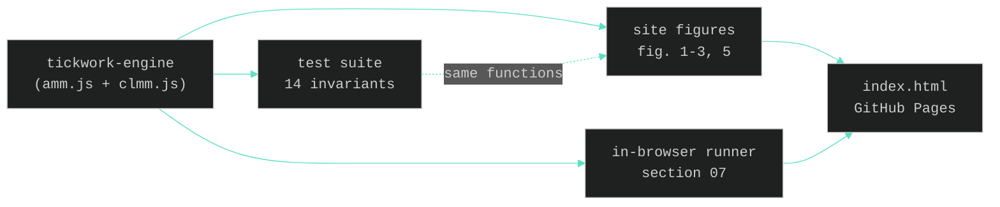

# tickwork

**Concentrated liquidity, as running code.** The full CLMM machine — tick math,
ranged positions, cross-tick swaps, fee accrual — as a dependency-free engine,
embedded live in an interactive site.

[](https://tick-work.com)
[](engine/test/engine.test.js)
[](engine/package.json)
[](LICENSE)
[](engine/src)
[](https://tick-work.com)

`x·y=k · concentrated liquidity · tick-crossing swaps · fee accrual · 14/14 tests · zero deps · reference implementation`

---

## The problem

Concentrated liquidity runs most on-chain trading — Uniswap v3, Orca Whirlpools,
Raydium CLMM — but almost nobody can explain how it works, and the "explanations"
that exist are static diagrams you have to take on faith.

Ticks, ranges, cross-tick swaps, fee growth: these are precise mechanisms, not
vibes. tickwork implements them as a small, readable, tested engine, then builds
the explainer *on top of the engine* — so every figure on the site is the real
math running, and the test suite executes in your browser. Don't trust the page.
Run it.

## How a swap evaluates

```js
import { ClmmPool } from "./engine/src/index.js";

const pool = new ClmmPool({ initialPrice: 100, tickSpacing: 10, feeBps: 30 });
const t = pool.tickCurrent;

// LP concentrates 1,000,000 liquidity within ~±10% of price
pool.addLiquidity(t - 1000, t + 1000, 1_000_000);

// a large swap walks across tick boundaries, consuming liquidity per range
const { amountOut, ticksCrossed, unfilledIn } = pool.swapExactIn(50_000, "Y");
// ticksCrossed > 0  -> the swap left the core range
// unfilledIn  === 0 -> the pool had the depth to fill it
```

The exact same functions power the interactive figures on the site — the backtest
in your editor and the slider on the page return identical numbers.

## What the engine implements

| Module | File | Models | Key behavior |
| --- | --- | --- | --- |
| Constant product | `amm.js` | `x·y=k` pool | Quotes, swaps, slippage, fees growing `k` |
| Tick math | `clmm.js` | `price <-> 1.0001^i` | Price/tick conversion, spacing alignment |
| Positions | `clmm.js` | Ranged liquidity | In-range needs both tokens; out-of-range needs one |
| Cross-tick swap | `clmm.js` | Boundary walking | Sheds/gains liquidity per range; partial fills when dry |
| Fee accrual | `clmm.js` | Growth-per-liquidity | Fees accrue to in-range LPs, paid out on close |

Every row is backed by tests in `engine/test/engine.test.js`. Run `npm test`.

## Architecture



The decision logic lives once in `engine/`. The site imports the same functions,
so the explainer and the implementation can never drift — a wrong equation would
fail a visible test on the page.

## Repository layout

```
tickwork/
├── index.html          the interactive site (GitHub Pages serves this)
├── preview.png         social share card
├── engine/
│   ├── src/            amm.js · clmm.js · index.js
│   ├── test/           14 invariant tests
│   └── README.md       full API reference
└── assets/             banner + profile art
```

## Run it

```bash
# the engine
cd engine && npm test          # 14/14 invariants

# the site (single static file)
python3 -m http.server 8000    # then open localhost:8000
```

## Honest scope

A **reference implementation for learning and prototyping**: floating point (not
production Q64.96 fixed-point), unaudited, no oracle or protocol fee. Fee
accounting is exact for positions that stay in range for their lifetime.
**Not for production funds.** Read it, test it, fork it.

## License

MIT — see [LICENSE](LICENSE).
